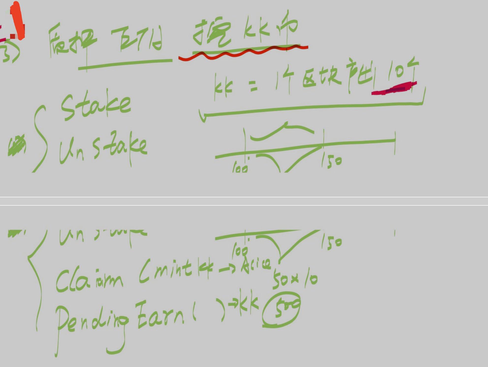

# 简易的质押挖矿




## A. 状态变量、事件

### 1. 接口 INFTMarket_V5

```solidity
// 声明结构体，用于记录质押挖矿的用户的本金、应计收益率和收益量（以 KKToken 数量计）
struct stakerOfMining {
    // 用户质押的本金
    uint256 principal;

    // 应计收益率（即上一次质押池的质押量变动时计算的挖矿收益率，即全局的单位质押对应的挖矿收益）
    uint256 accrualInterestAdjusted;

    // 用户应获得的因质押而产生的收益量（用户应获得的 KKToken 的数量）
    uint256 earned;
}
    
// 当用户质押 ETH 或 WETH 参与挖矿时触发
event WETHStaked_Mining(address user, uint256 stakedAmount, uint256 stakeInterestAdjusted);

// 当用户撤出质押 ETH 或 WETH （挖矿的质押）时触发
event WETHUnstaked_Mining(address user, uint256 unstakedAmount, uint256 stakeInterestAdjusted);
```

---

### 2. 合约 NFTMarket_V5

```Solidity
    // 映射(用户地址 => 用户的质押信息结构体)
    mapping(address account => stakerOfMining stakerStruct_mining) public staker_mining;
		
    // 作为挖矿收益的 KKToken 的合约地址
    address public immutable KKToken_Mining;
    
    // 全局的挖矿收益率（单位质押量对应的挖矿收益，以 KKToken 数量计）
    uint256 public miningInterestAdjusted;
    
    // 单个区块所挖出的 KKToken 数量
    uint256 public minedAmountPerBlock;
    
    // 最近计算全局挖矿收益率的区块号
    uint256 public BlockNumberLast;
    
    // 用于分配挖矿收益的质押池的 WETH 总数量
    uint256 public stakePool_Mining; 
```


## B. NFTMarket_V5 合约相关代码

### 1. 方法 {stakeETH_Mining}：质押 ETH 参与挖矿

```solidity
function stakeETH_Mining() public payable {
    uint256 _stakedAmount = msg.value;
    if (_stakedAmount == 0) {
        revert stakeZero();
    }
    // 更新全局挖矿收益率和应计区块号
    _updateInterest_Mining();

    // 更新用户应获得的挖矿收益
    staker_mining[msg.sender].earned += staker_mining[msg.sender].principal * (miningInterestAdjusted - staker_mining[msg.sender].accrualInterestAdjusted) / MANTISSA;

    // 将用户转入的 ETH 存入 WETH9 合约，即用户的质押以 WETH 的形式保存在本合约
    IWETH9(wrappedETHAddr).deposit{value: _stakedAmount}();

    // 更新保存调用者的质押信息的结构体各字段
    staker_mining[msg.sender].principal += _stakedAmount;
    staker_mining[msg.sender].accrualInterestAdjusted = miningInterestAdjusted;

    // 更新质押池的总金额
    stakePool_Mining += _stakedAmount;
    emit WETHStaked_Mining(msg.sender, _stakedAmount, miningInterestAdjusted);
}
```

----

### 2. 方法 {stakeWETH_Mining}：质押 WETH 参与挖矿

```Solidity
function stakeWETH_Mining(uint256 _stakedAmount) public {
    if (_stakedAmount == 0) {
        revert stakeZero();
    }

    // 更新全局挖矿收益率和应计区块号
    _updateInterest_Mining();

    // 更新用户应获得的挖矿收益
    staker_mining[msg.sender].earned += staker_mining[msg.sender].principal * (miningInterestAdjusted - staker_mining[msg.sender].accrualInterestAdjusted) / MANTISSA;

    // 将用户的 WETH 存入本合约
    IWETH9(wrappedETHAddr).transferFrom(msg.sender, address(this), _stakedAmount);

    // 更新保存调用者的质押信息的结构体各字段
    staker_mining[msg.sender].principal += _stakedAmount;
    staker_mining[msg.sender].accrualInterestAdjusted = miningInterestAdjusted;

    // 更新质押池的总金额
    stakePool_Mining += _stakedAmount;
    emit WETHStaked_Mining(msg.sender, _stakedAmount, miningInterestAdjusted);
}
```

---

### 3. 方法 {unstakeWETH_Mining}：解除质押、退出挖矿并获取挖矿收益

```solidity
function unstakeWETH_Mining(uint256 _unstakeAmount) public {
    if (_unstakeAmount == 0 || _unstakeAmount > staker_mining[msg.sender].principal) {
        revert invalidUnstakedAmount();
    }

    // 更新全局挖矿收益率和应计区块号
    _updateInterest_Mining();

    // 更新用户应获得的挖矿收益
    staker_mining[msg.sender].earned += staker_mining[msg.sender].principal * (miningInterestAdjusted - staker_mining[msg.sender].accrualInterestAdjusted) / MANTISSA;

    // 计算用户解除质押的数额所对应的挖矿收益
    uint256 correspondingInterest = _unstakeAmount * staker_mining[msg.sender].earned / staker_mining[msg.sender].principal;

    // 用户取回的本金（WETH）计入本合约内该用户的 WETH 余额内（可用方法 {withdrawFromWETHBalance} 取出 WETH 到用户地址）
    userBalanceOfWETH[msg.sender] += _unstakeAmount;

    // 将挖矿收益（KKToken）转给解除质押的用户
    KKToken(KKToken_Mining).transfer(msg.sender, correspondingInterest);

    // 更新保存调用者的质押信息的结构体各字段
    staker_mining[msg.sender].earned -= correspondingInterest;
    staker_mining[msg.sender].principal -= _unstakeAmount;
    staker_mining[msg.sender].accrualInterestAdjusted = miningInterestAdjusted;

    // 更新质押池的总金额
    stakePool_Mining -= _unstakeAmount;
    emit WETHUnstaked_Mining(msg.sender, _unstakeAmount, miningInterestAdjusted);
}
```

---

### 4. 只读方法 {pendingEarn_Mining}：获取调用者可提取的挖矿收益的数量

```solidity
function pendingEarn_Mining() public view returns (uint256) {
    return staker_mining[msg.sender].earned;
}
```

---

### 5. 内部方法 {_updateInterest_Mining}：更新全局的挖矿收益率并更新应计区块号

```solidity
function _updateInterest_Mining() internal {
    //  当质押池内金额为 0 时，则挖矿收益率置为 0
    if (stakePool_Mining == 0) {
        miningInterestAdjusted = 0;
        BlockNumberLast = block.number;
    }
    // 当应计区块号（上一次计算挖矿收益率的区块号`BlockNumberLast`）不为当前区块号时，则执行如下变量更新：
    if (block.number != BlockNumberLast && stakePool_Mining != 0) {
    // 为当前合约铸造数量为`minedAmountPerBlock`的 KKToken 作为挖矿奖励
    KKToken(KKToken_Mining).mint(address(this), minedAmountPerBlock * (block.number - BlockNumberLast));
    // 更新全局挖矿的收益率
    miningInterestAdjusted += (block.number - BlockNumberLast) * minedAmountPerBlock * MANTISSA / stakePool_Mining;

    // 令应计区块号被赋值为当前区块号，以供下次更新挖矿收益率时时使用
    BlockNumberLast = block.number;
    }
}
```

<br />


> [!NOTE]
>
> **部分合约说明**：
>
> - [**INFTMarket_V5**](./src/interfaces/INFTMarket_V5_1.sol)：NFTMarket 的结构体、事件、错误信息、接口
>
> - [**NFTMarket_V5**](./src/NFTMarket_V5_1.sol)：NFTMarket 的方法
>
> - [**KKToken**](./src/KKToken.sol)：质押挖矿的奖励 Token

