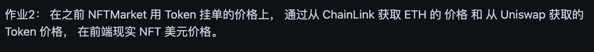
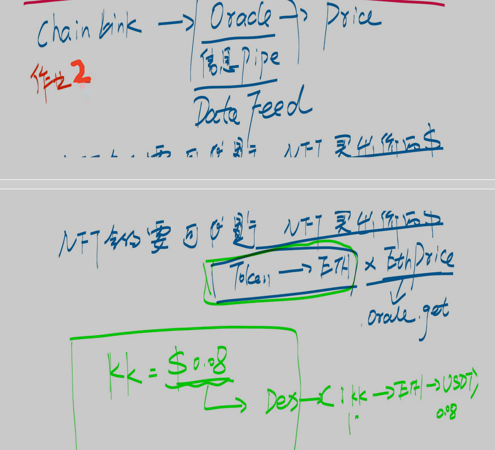
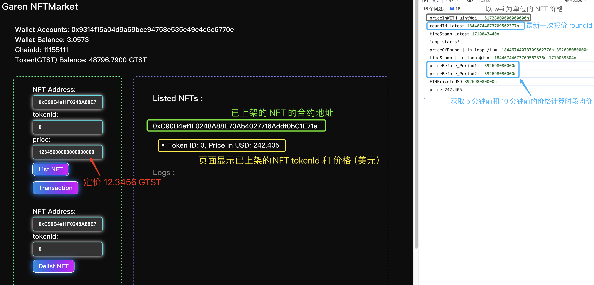

# 练习题（02.29）：练习题 2





## 0. 开门见山

### 0-1. 相关合约的部署信息

- [**NFTMarket_Simplified**](./src/NFTMarket_Simplified.sol) 合约（NFTMarket 合约）：https://sepolia.etherscan.io/address/0xa81c1b905d3d9fe0c5be1982f71d80a95f7ba028
- **GTST 合约**（NFT 交易直接使用的代币合约）：https://sepolia.etherscan.io/address/0x3490ff3bc24146AA6140e1efd5b0A0fAAEda39E9
- **WETH 合约**：https://sepolia.etherscan.io/address/0xebe8d728847fd06179f19070e9288dd207def69d
- **UniswapV2Router02 合约**：https://sepolia.etherscan.io/address/0x5bee116a927f718dff1dfaeed062a30b3cb483b2
- **UniswapV2Factory 合约**：https://sepolia.etherscan.io/address/0xc69c2ee6f11658f7d639a71624b62ba855952c55

### 0-2. 相关交易

- **DEX 注入流动性**：https://sepolia.etherscan.io/tx/0xad2c7d0957ecf75f83b5d2f0ba86816cd2dbe33d04d4ff70a964c318c7e3055e
  - ETH ：1 ether (decimal: 18)
  - GTST：200 GTST (decimal: 18)
- **NFT 上架**：https://sepolia.etherscan.io/tx/0xce757a8fd9a9d43e9d9ae3cc7c2ba664bffed5d39536d3d4341c96884f612c88
  - 定价：12.3456 GTST (decimal: 18)

### 0-3. 前端代码

- [**前端代码**](./FrontEnd)：在 *FrontEnd* 路径下执行`npm install`安装全部依赖项，然后执行 `npm run dev`命令运行。

### 0-4. 页面结果展示



## 1. 合约相关代码说明

### 1-1. 上架 NFT

注：本合约的上架采用将 NFT 转移至合约内，并为原持有者（卖家）地址做授权来实现，而非仅做“与上架相关的某个状态变量”的值的修改（此方式亦可），特此说明。

#### 方法 {list}：用户调用此方法将指定的 NFT 上架

```solidity
function list(address _nftAddr, uint256 _tokenId, uint256 _price) external {
        if (msg.sender != IERC721(_nftAddr).ownerOf(_tokenId)) {
            revert notOwnerOfNFT();
        }
        if (_price == 0) revert zeroPrice();
        require(price[_nftAddr][_tokenId] == 0, "This NFT is already listed");
        // 调用内部方法 {_List}
        _List(_nftAddr, _tokenId, _price);
    }
```

#### 内部方法 {_List}：执行 NFT 上架操作

```solidity
function _List(address _nftAddr, uint256 _tokenId, uint256 _price) internal {
        IERC721(_nftAddr).safeTransferFrom(msg.sender, address(this), _tokenId, "List successfully");
        IERC721(_nftAddr).approve(msg.sender, _tokenId);
        price[_nftAddr][_tokenId] = _price;
        emit NFTListed(msg.sender, _nftAddr, _tokenId, _price);
    }
```

---

### 1-2. 获取 ETH 当前价格

```Solidity
// 通过 Chainlink 的 PriceFeed Aggregator 合约获取 ETH 的当前价格
// 仅接收 3 个返回值 roundId、answer 和 updatedAt ，并分别用 `_roundId`、`_price`和`_updatedAt`接收它们，亦作为当前函数的返回值
function getLatestPrice_ETH_USD() public view returns (uint80 _roundId, int256 _price, uint256 _updatedAt) {
        (
            _roundId,
            _price,
            /*uint256 startedAt*/,
            _updatedAt,
            /*uint80 answeredInRound*/
        ) = priceFeedAggregator.latestRoundData();
    }
```

---

### 1-3. 获取 PriceFeed Aggregator 的特定轮次的 ETH 的价格

```Solidity
// 通过 Chainlink 的 PriceFeed Aggregator 合约获取在轮次等于`_roundId`时的 ETH 的价格
// 仅接收 2 个返回值 answer 和 updatedAt ，并分别用`_price`和`_updatedAt`接收它们，亦作为当前函数的返回值
function getPriceOfRound(uint80 _roundId) public view returns (int256 _price, uint256 _updatedAt) {
        (
            /*uint80 roundId*/,
            _price,
            /*uint256 startedAt*/,
            _updatedAt,
            /*uint80 answeredInRound*/
        ) = priceFeedAggregator.getRoundData(_roundId);
    }
```

---

### 1-4. 获取 NFT 的价格（以 ETH 计价，单位为 wei）

#### 方法 {getNFTPrice_CountedInWETH}：计算以 wei 为单位的 NFT 价格

```Solidity
function getNFTPrice_CountedInWETH(address _NFTAddr, uint256 _tokenId) public view returns (uint256) {
        uint256 priceInGTST = price[_NFTAddr][_tokenId];
        // 调用内部方法 {getReserves_GTST_WETH}
        (uint256 reserve_GTST, uint256 reserve_WETH) = getReserves_GTST_WETH();
        require(reserve_WETH != 0, "Reserve of WETH is 0");
        uint256 priceInWETH = (priceInGTST * reserve_WETH) / reserve_GTST;
        return priceInWETH;
    }
```

#### 内部方法 {getReserves_GTST_WETH}：获取 GTST 与 ETH 在 DEX 中的储备量

```solidity
function getReserves_GTST_WETH() public view returns(uint reserveA, uint reserveB) {
        address factoryAddr = UniswapV2Router02(payable(routerAddr)).factory();
        (reserveA, reserveB) = UniswapV2Library.getReserves(factoryAddr, GTSTAddr, wrappedETHAddr);
    }
```


## 2. 前端相关代码说明

[APP.tsx](./FrontEnd/src/App.tsx#L104-L190)文件中，{handleNFTMarket_List} 方法用于与合约 **NFTMarket_Simplified** 进行交互并执行 NFT 的上架操作。以下仅注释与本练习题相关的局部代码：

```typescript
const handleNFTMarket_List = async () => {
    const NFTAddress = NFTAddressRef_List.current?.value;
    const tokenId = tokenIdRef_List.current?.value;
    const NFTPrice = NFTPriceRef_List.current?.value;
    const isApproved = await NFTMarket.checkIfApprovedByNFT(NFTAddress, tokenId);
    const ownerOfNFT = await NFTMarket.getNFTOwner(NFTAddress, tokenId);
    try {
      if (ownerOfNFT == NFTMarketAddress) {
        setError(true)
        setErrorMessage("This NFT has already listed in this NFTMarket")
        setError(false)
        return
      }
      if (!isApproved) {
        setError(true)
        setErrorMessage("Before listing NFT, this NFTMarket should be approved by corresponding NFT in advance")
        setisNFTMarketApproved(false)
        return
      }
      let tx = await NFTMarket.list(NFTAddress, tokenId, NFTPrice)
      TxURL_List = scanURL + 'tx/' + tx.hash
      const receipt = await tx.wait()
      _updateStateAfterTx(receipt)
      if (receipt) {
        if (NFTAddress && tokenId) {
          // 声明 2 个用于接收过去某一个时刻的 ETH 价格的变量
          let priceBefore_Period1;
          let priceBefore_Period2;
          
          // 声明一个标记开关，用于在回溯到 Period1 时打开并避免重复记录价格
          let isRecorded = false;
          
          // 将前端页面中输入的 string 类型的`tokenId`转换为数字整数
          const tokenIdNum = parseInt(tokenId);
          
          // 执行合约的 {getNFTPrice_CountedInWETH} 方法并接收返回值，以此获得上架的 NFT 的 ETH 价格（单位：wei）
          const priceInWETH = await NFTMarket.getNFTPrice_CountedInWETH(NFTAddress, tokenIdNum);
          
          // 获取最新的 ETH 报价对应的 roundId 和 报价时刻的时间戳
          const [roundId_Latest, _, timeStamp_Latest] = await NFTMarket.getLatestPrice_ETH_USD();
          
          // 回溯遍历至“至少 5 分钟前”和“至少 10 分钟前”的两时刻处的 ETH 价格
          for (let i = roundId_Latest - BigInt(1); i > 0; i--) {
            const [priceOfRound, timeStamp] = await NFTMarket.getPriceOfRound(i);
            if (timeStamp <= timeStamp_Latest - BigInt(300) && isRecorded == false) {
              // 此处获取“至少 5 分钟前”的 ETH 价格
              priceBefore_Period1 = priceOfRound;
              
              // 令标记开关打开，后续循环将不重复执行`priceBefore_Period1`的赋值
              isRecorded = true;
            }
            if (timeStamp <= timeStamp_Latest - BigInt(600)) {
              // 此处获取“至少 10 分钟前”的 ETH 价格
              priceBefore_Period2 = priceOfRound;
              break;
            }          
          }
          // 计算两个 ETH 报价的平均价格
          const ETHPriceInUSD = (priceBefore_Period1 + priceBefore_Period2) / BigInt(2);
          
          // 使用 BigNumber.js 库对数据做处理
          const priceInWETH_BigNumber = new BigNumber(priceInWETH.toString());
          const ETHPriceInUSD_BigNumber = new BigNumber(ETHPriceInUSD.toString());
          
          // 从 PriceFeed Aggregator 中获取的 ETH/USD 价格的 decimal 为 8
          // ETH 的 decimal 为 18 
          // 因此计算的结果应当扣除 18 + 8 个小数位即为以 USD 为定价货币的最终价格（`price`）
          const priceWithoutDecimals = priceInWETH_BigNumber.multipliedBy(ETHPriceInUSD_BigNumber).dividedBy(new BigNumber("10").pow(18 + 8));
          
          // 保留 NFT 美元价格的 3 位小数
          const price = priceWithoutDecimals.toFixed(3);
          const object = {tokenId: tokenIdNum, priceInUSD: price}
          
          // 使用 React set 方法使 NFTList 追加此被商家的 NFT 的信息，用于前端页面展示
          setListedNFT(prevListedNFT => {
            const updatedList = { ...prevListedNFT };
            if (!updatedList[NFTAddress]) {
              updatedList[NFTAddress] = [];
            }
            updatedList[NFTAddress].push(object);
            return updatedList;
          });
        }
      }
      setError(false)
    } catch (err: any) {
      setError(true)
      setErrorMessage(err.message)
    }
  }
```

